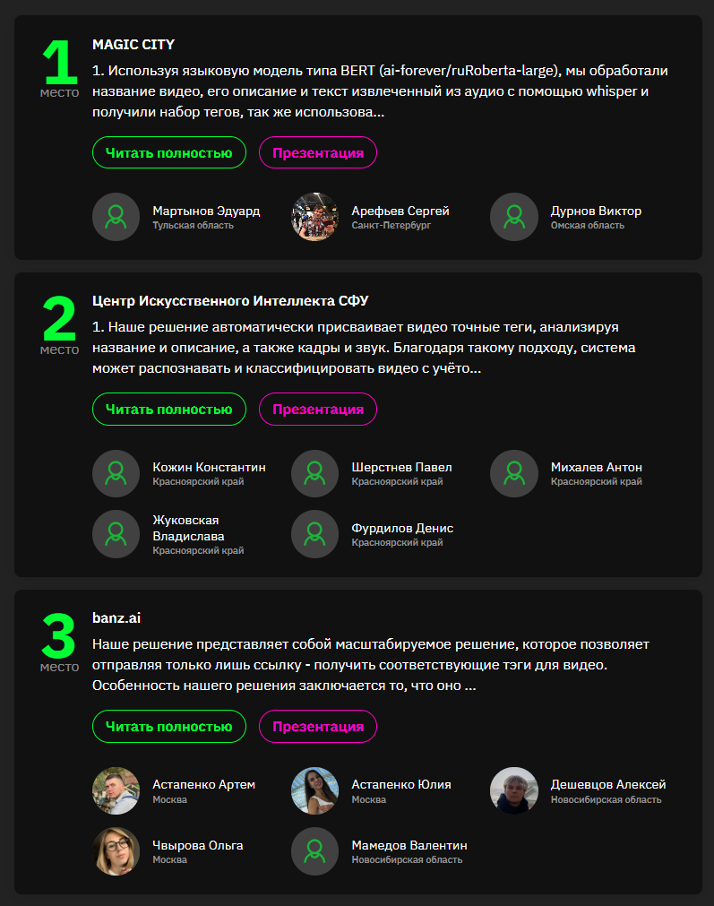

# 🚀 Хакатон: «Цифровой прорыв. Сезон: Искусственный интеллект» 🤖

# 📌 Кейс: Генерация тегов для видео

## 🎯 Команда: Центр Искусственного Интеллекта СФУ 🧠

---

<table>
<tr>
<td align="left" width="50%">

### 🏆 **2 место** на Всероссийском хакатоне 2024 года  
📍 **Организатор:** «Цифровой прорыв. Сезон: Искусственный интеллект»  
🔗 [Ссылка на мероприятие](https://hacks-ai.ru/events/1077379)

### 📖 Описание кейса:
💡 Разработка системы для **автоматического тегирования видео** на основе его содержимого, названия и описания по иерархическому списку от **Рутуб**.

### 👥 Участники команды:
- [Константин Кожин](https://github.com/konstantinkozhin) — **Руководитель команды;** 
- [Павел Шерстнев](https://github.com/sherstpasha) — **Data Scientist;**  
- [Владислава Жуковская](https://github.com/vlada2025) — **Дизайнер;**  
- [Антон Михалев](https://github.com/asmikhalev) — **ML-инженер;**  
- [Денис Фурдилов](https://github.com/hentaibaka) — **Backend-разработчик, MLOps.**  

</td>
<td align="center" width="50%">

</td>
</tr>
</table>
