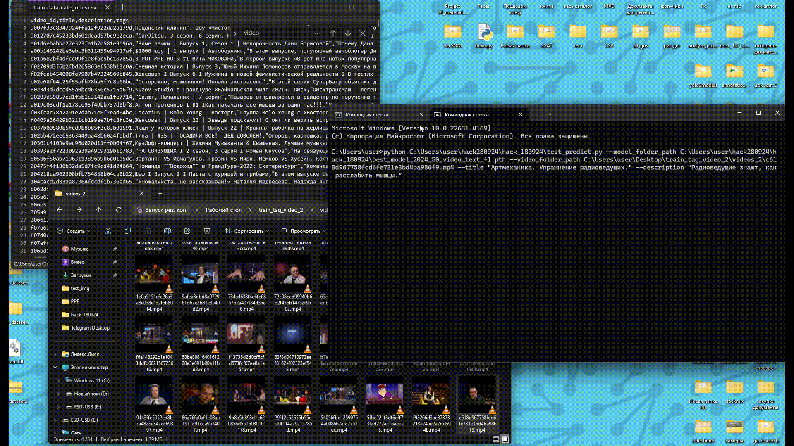
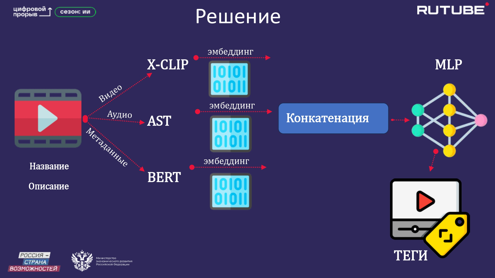

# 🚀 Хакатон: «Цифровой прорыв. Сезон: Искусственный интеллект» 🤖

# 📌 Кейс: Генерация тегов для видео

## 🎯 Команда: Центр Искусственного Интеллекта СФУ 🧠

---

<table>
<tr>
<td align="left" width="50%">

### 🥈 Место: 2  
📍 **Всероссийский хакатон 2024 года**  
🔗 [Ссылка на мероприятие](https://hacks-ai.ru/events/1077379)

### 📖 Описание кейса:
Разработка системы для **автоматического тегирования видео** на основе его содержимого, названия и описания по иерархическому списку от **Рутуб**.

### 👥 Участники команды:
- [Константин Кожин](https://github.com/konstantinkozhin) — **Руководитель команды;** 
- [Павел Шерстнев](https://github.com/sherstpasha) — **Data Scientist;**  
- [Владислава Жуковская](https://github.com/vlada2025) — **Дизайнер;**  
- [Антон Михалев](https://github.com/asmikhalev) — **ML-инженер;**  
- [Денис Фурдилов](https://github.com/hentaibaka) — **Backend-разработчик, MLOps.**  

</td>
<td align="center" width="50%">

</td>
</tr>
</table>

## 📌 Описание решения

### 🔹 Общая концепция
Наше решение **автоматически присваивает видео точные теги**, анализируя **название, описание, кадры и звук**. Такой комплексный подход позволяет **точно классифицировать видео**, учитывая все его характеристики, что **улучшает поиск и рекомендации** на платформе.

### 🤖 Мультимодальный анализ
Мы **объединяем текстовые, визуальные и аудиоданные** в единую структуру, что позволяет **учитывать весь контекст** видео и **точно выделять ключевые признаки** для классификации.

## 🎥 Screencast (Демонстрация решения)
Посмотрите короткий видеоролик с демонстрацией функционала MVP-системы.  

📌 **[Смотреть видеоролик](Screencast.mp4)**  

---

## 📊 Схема работы модели  
Ниже представлена схема, отражающая архитектуру решения:

  

### 🔹 Описание используемых моделей

1. **[X-CLIP](https://huggingface.co/microsoft/xclip-base-patch16-zero-shot)**  
   Используется для анализа визуальной информации из видеоконтента. X-CLIP помогает извлекать **видеофреймы** и преобразовывать их в эмбеддинги для последующей обработки.

2. **[AST (Audio Spectrogram Transformer)](https://huggingface.co/MIT/ast-finetuned-audioset-10-10-0.4593)**  
   Применяется для анализа аудиотреков. Эта модель преобразует звуковые данные в **спектрограммы** и извлекает из них важные признаки для классификации.

3. **[BERT](https://huggingface.co/google-bert/bert-base-uncased)**  
   Используется для анализа текстовой информации (название и описание видео). Модель преобразует текст в эмбеддинги, которые учитывают контекст и семантическую структуру данных.

4. **MLP (Multi-Layer Perceptron)**  
   Объединяет эмбеддинги из всех предыдущих моделей (видео, аудио и текст) и производит финальную классификацию, генерируя список тегов.  
   📌 **[Скачать обученную версию MLP](best_final_model.pth)**.  
   📌 **Детали обучения нейросети см. в [README_NET.md](README_NET.md).**

---
